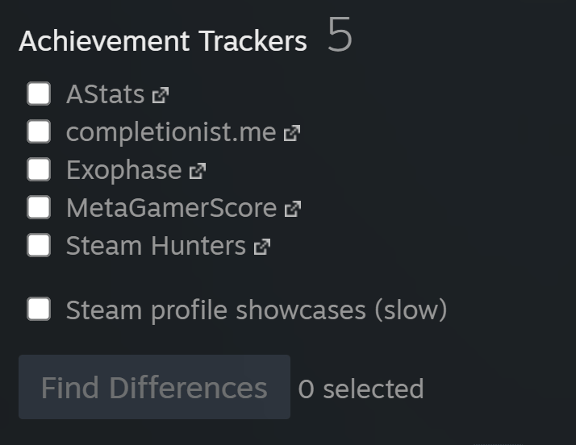

# achievement-tracker-comparer
Compare achievements between
[AStats](https://astats.astats.nl/astats/),
[completionist.me](https://completionist.me/),
[Exophase](https://www.exophase.com/),
[MetaGamerScore](https://metagamerscore.com/),
[Steam Hunters](https://steamhunters.com/profiles)
and Steam Community profiles.

## Instructions
1. Install a userscript manager:
   - [Violentmonkey](https://violentmonkey.github.io/) (recommended).
   - [Tampermonkey](https://tampermonkey.net/) (supports more browsers).
   - [Greasemonkey](https://addons.mozilla.org/en-US/firefox/addon/greasemonkey/) (open source, Firefox-only).
2. Install this userscript: [Achievement Tracker Comparer](https://github.com/RudeySH/achievement-tracker-comparer/raw/main/dist/achievement-tracker-comparer.user.js).
   - If you're using Violentmonkey, press the "Confirm installation" button on the top-right.
   - If you're using Tampermonkey, press the "Install" or "Reinstall" button on the top-left.
   - If you're using Greasemonkey, press the "Install" button on the bottom-left.
4. Go to your [Steam Community profile](https://steamcommunity.com/my).
5. Use the new "Achievement Trackers" section near the bottom of the sidebar.

To update the installed userscript to the latest version, simply do step 2 again.

[Support Steam Hunters](https://steamhunters.com/supporters)
